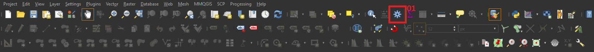
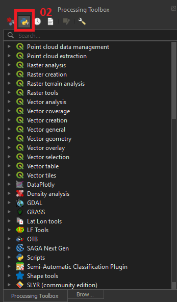
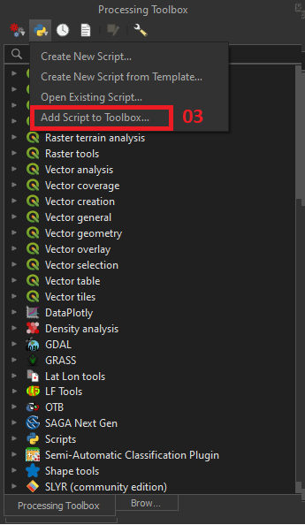
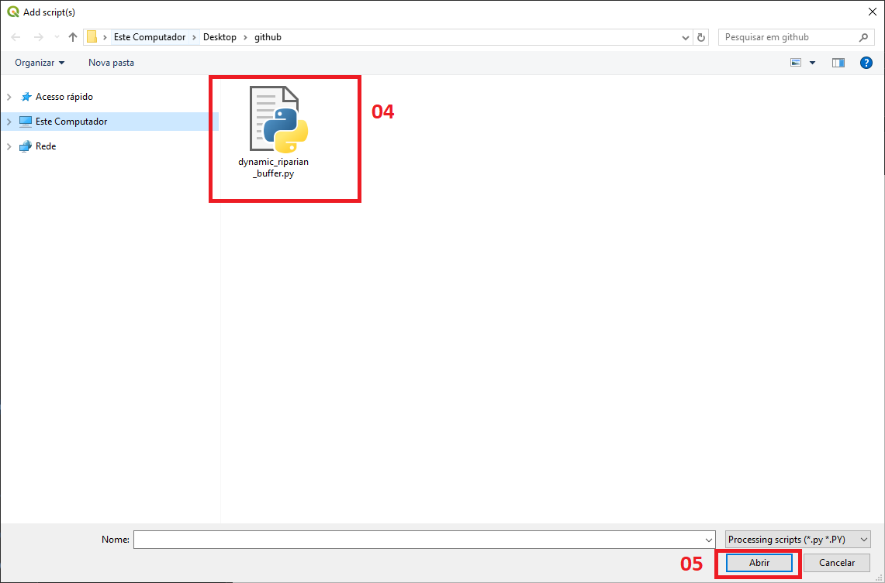
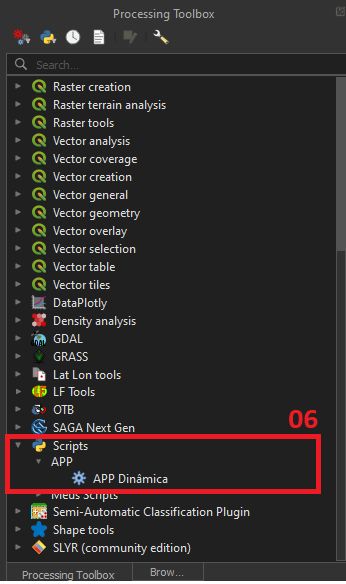
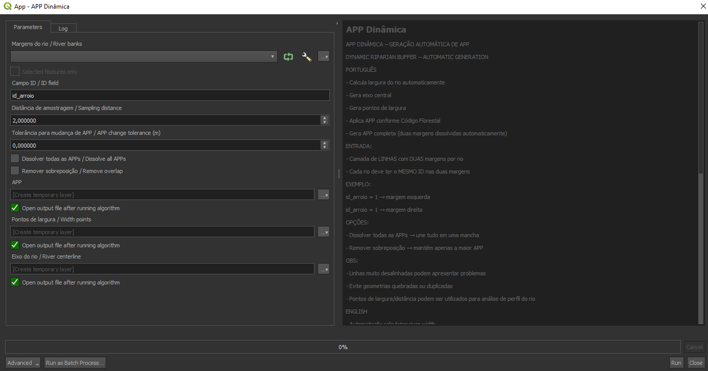

# QGIS APP Dinâmica / Dynamic Riparian Buffer

## Contexto e Motivação / Context and Motivation

**PORTUGUÊS**
Este projeto foi desenvolvido a partir de demandas em projetos de planejamento urbano e ambiental, especialmente na delimitação de Áreas de Preservação Permanente (APP) em cursos d’água.

Na prática, a definição de APPs é frequentemente realizada de forma manual ou com métodos simplificados, o que pode gerar inconsistências, baixa reprodutibilidade e alto tempo de processamento, principalmente em áreas extensas ou com grande quantidade de cursos d'água.

Além disso, a largura dos cursos d’água varia ao longo do seu percurso, o que exige uma abordagem mais precisa e adaptativa para aplicação das faixas de APP conforme o Código Florestal Brasileiro.

Diante desse cenário, esta ferramenta foi criada com os seguintes objetivos:

- Automatizar o processo de delimitação de APP
- Aumentar a consistência e padronização dos resultados
- Reduzir o tempo de execução em projetos técnicos
- Incorporar a variabilidade da largura do rio ao longo do seu eixo
- Apoiar análises em planejamento urbano, ambiental e territorial

A ferramenta foi pensada para uso direto no QGIS, integrada ao fluxo de trabalho de profissionais que atuam com geoprocessamento aplicado.

**ENGLISH**
This project was developed based on real-world demands in urban and environmental planning projects, particularly for the delineation of Permanent Preservation Areas (APP) along watercourses.

In professional practice, APP delineation is often performed manually or using simplified methods, which can lead to inconsistencies, low reproducibility, and significant processing time, especially in large areas or regions with dense hydrographic networks.

Additionally, river width varies along its course, requiring a more precise and adaptive approach to correctly apply buffer distances according to the Brazilian Forest Code.

In this context, this tool was developed with the following objectives:

- Automate the APP delineation process
- Improve consistency and standardization of results
- Reduce processing time in technical projects
- Incorporate river width variability along its course
- Support urban, environmental, and territorial planning analyses

The tool was designed for direct use within QGIS, integrating seamlessly into GIS-based professional workflows.

---

## Sobre / About

**PORTUGUÊS**
Esta ferramenta calcula a largura do rio a partir de duas margens vetoriais, gera o eixo central e aplica automaticamente a largura de APP correspondente.

**ENGLISH**
This tool calculates river width from two bank lines, generates the centerline, and automatically applies the appropriate riparian buffer.

---

## Funcionalidades / Features

**PORTUGUÊS**

* Cálculo automático da largura do rio
* Geração do eixo central
* Geração de pontos de amostragem de largura
* Aplicação automática das regras do Código Florestal
* Geração de APP contínua (sem falhas entre margens)
* Opção de dissolver todas as APPs
* Opção de remover sobreposição

**ENGLISH**

* Automatic river width calculation
* Centerline generation
* Width sampling points generation
* Automatic application of Brazilian Forest Code rules
* Continuous APP generation (no gaps between banks)
* Option to dissolve all APPs
* Option to remove overlaps

---

## Entrada de dados / Input Data

**PORTUGUÊS**

* Camada de linhas representando as margens do rio
* Cada rio deve possuir exatamente duas linhas (margem esquerda e direita)
* Ambas devem compartilhar o mesmo valor em um campo ID

**ENGLISH**

* Line layer representing river banks
* Each river must have exactly two lines (left and right banks)
* Both must share the same value in an ID field

### Exemplo / Example

| id_arroio | geometria       |
| --------- | --------------- |
| 1         | margem esquerda |
| 1         | margem direita  |

---

## Parâmetros / Parameters

**PORTUGUÊS**

* Margens do rio
* Campo ID
* Distância de amostragem
* Tolerância para mudança de APP
* Dissolver todas as APPs
* Remover sobreposição

**ENGLISH**

* River banks
* ID field
* Sampling distance
* APP change tolerance
* Dissolve all APPs
* Remove overlap

---

## Saídas / Outputs

**PORTUGUÊS**

* APP: Polígonos de área de preservação permanente
* Pontos de largura: Pontos com largura do rio ao longo do eixo
* Eixo do rio: Linha central gerada

**ENGLISH**

* APP: Permanent preservation area polygons
* Width points: Points containing river width along the centerline
* River centerline: Generated centerline

---

## Metodologia / Methodology

**PORTUGUÊS**

1. Amostragem ao longo de uma das margens
2. Cálculo da distância até a margem oposta
3. Geração do eixo central
4. Classificação da largura conforme o Código Florestal
5. Geração de buffers nas margens
6. Construção de geometria contínua da APP utilizando operações espaciais robustas

**ENGLISH**

1. Sampling along one river bank
2. Distance calculation to the opposite bank
3. Centerline generation
4. Width classification according to the Brazilian Forest Code
5. Buffer generation along river banks
6. Construction of continuous APP geometry using robust spatial operations

---

## Regras de APP / APP Rules (Brazilian Forest Code)

| Largura do rio / River width | APP   |
| ---------------------------- | ----- |
| até 10 m / up to 10 m        | 30 m  |
| 10–50 m                      | 50 m  |
| 50–200 m                     | 100 m |
| 200–600 m                    | 200 m |
| > 600 m                      | 500 m |

---

## Requisitos / Requirements

**PORTUGUÊS**

* QGIS 3.x
* Python
* Bibliotecas: numpy, shapely

**ENGLISH**

* QGIS 3.x
* Python
* Libraries: numpy, shapely

---

## Como usar / How to Use

**PORTUGUÊS**

1. Abra o QGIS
2. Vá em Processamento > Caixa de Ferramentas

4. Na caixa de ferramentas, adicione o Script

5. Execute a ferramenta "APP Dinâmica"

7. Configure os parâmetros e execute

**ENGLISH**

1. Open QGIS
2. Go to Processing > Toolbox (see steps above)
3. Add the script via the Python Scripts option
4. Run the "APP Dinâmica" tool
5. Set the parameters and run

---

## Limitações / Limitations

**PORTUGUÊS**

* A ferramenta assume que cada rio possui exatamente duas margens
* Linhas muito desalinhadas podem gerar distorções na largura calculada
* Geometrias inválidas podem resultar em falhas na geração da APP
* Em áreas complexas (confluências, ilhas), o resultado pode exigir ajustes manuais

**ENGLISH**

* The tool assumes each river has exactly two bank lines
* Highly misaligned lines may distort width calculation
* Invalid geometries may cause issues in APP generation
* Complex areas (confluences, islands) may require manual adjustments

---

## Autor / Author

Guilherme Silveira Cardoso
Especialista em Geoprocessamento / GIS Specialist

GitHub: https://github.com/gsgeocardoso
LinkedIn: https://www.linkedin.com/in/gscardoso-bio
